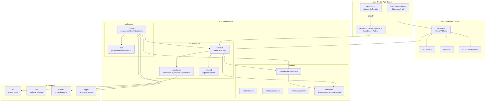

# Arquitectura — gastos-personales

> El overview de arquitectura para `gastos-personales`. El
> proyecto sigue **arquitectura modular + clean** (ver
> skill `architecture-standards`). La dirección de
> dependencias es estricta: `UI → Application → Domain ←
Infrastructure`. La comunicación cross-module sucede
> exclusivamente a través de `src/shared/events/`, nunca
> mediante imports directos.
>
> La sección Auth de abajo documenta el cambio
> `auth-foundation` (Next.js 16 + Auth.js v5 + Prisma 6 +
> Hono catch-all + PostgreSQL). El diseño completo está
> en `openspec/changes/auth-foundation/design.md`; esta
> página es el mapa de un vistazo para los ingenieros que
> se suman al proyecto.

## Auth

El módulo `auth` aterriza la capa completa de identidad
para `gastos-personales`. Es dueño de 4 tablas manejadas
por Prisma (`User`, `Account`, `Session`,
`VerificationToken`) sobre PostgreSQL (Neon en dev/prod,
testcontainers en CI), un provider de Credentials con
hashing Argon2id, Google OAuth 2.0 con auto-link por match
de email, una estrategia de sesiones en base de datos de
30 días con ventana deslizante de 24 horas, y un catch-all
de Hono que hostea la API de aplicación no-auth en
`/api/*` junto al `/api/auth/*` de Auth.js.

### Arquitectura de alto nivel

**Responsabilidades por capa** (la dirección de
dependencias es estricta: `UI → Application → Domain ←
Infrastructure`):

- **`app/`** (UI) — páginas, layouts, server components y
  los dos route handlers de API del App Router de Next.js.
  No tiene lógica de negocio.
- **`src/modules/api/`** (UI-shaped) — instancia Hono
  `OpenAPIHono` en `app/api/[...path]/route.ts`. Llama a
  las acciones de aplicación.
- **`src/modules/auth/`** — domain (entities, services,
  ports), application (actions, DTOs), infrastructure
  (repositorios, wrapper de Argon2id, config de Auth.js).
- **`src/shared/`** — infraestructura cross-cutting:
  cliente de Prisma, schema de env (Zod), event
  dispatcher in-process, logger estructurado.

### Modelo de datos

Cuatro modelos de Prisma, dueños de `prisma/schema.prisma`.
Se suman tres columnas a `User` por encima del schema
canónico de Auth.js: `passwordHash` (BR-AUTH-3, BR-AUTH-9),
`defaultProvider` (BR-AUTH-13) y `lastLoginAt` (estampado
por el callback `signIn`).

| Modelo              | Propósito                                                                                                          | Restricciones clave                                                     |
| ------------------- | ------------------------------------------------------------------------------------------------------------------ | ----------------------------------------------------------------------- |
| `User`              | Ancla de identidad; carga credenciales + perfil.                                                                   | `email @unique`, `@@index([createdAt])`                                 |
| `Account`           | Link de OAuth; una fila por `(provider, providerAccountId)`.                                                       | `@@unique([provider, providerAccountId])` (BR-AUTH-10)                  |
| `Session`           | Fila de sesión en DB (sin JWT en la cookie).                                                                       | `sessionToken @unique`, `@@index([expires])` (para el futuro job de GC) |
| `VerificationToken` | Tokens de verificación de email / reset de password (vacíos en MVP; el cambio `email-verification` los va a usar). | `@@unique([identifier, token])`                                         |

Índices: `User.email` es `@unique` (la query `findUnique`
en `authorize()` de Credentials es el patrón de acceso
principal). `Account(provider, providerAccountId)` es
`@@unique` — la línea de defensa de BR-AUTH-10 contra el
ataque de "la misma cuenta de Google linkeada a dos
usuarios". `Session.sessionToken` es `@unique` (se
consulta en cada llamada a `auth()`). `Session.expires` y
`User.createdAt` llevan `@@index` explícitos para el
futuro job de GC y para las queries bulk de
`user-deletion`.

Cascade: `Account.user` y `Session.user` usan
`onDelete: Cascade`. El cambio `user-deletion` es dueño
del flujo de baja; este cambio entrega la restricción a
nivel de schema.

### Rutas

**8 rutas de Auth.js** (montadas en
`app/api/auth/[...nextauth]/route.ts`):

| Método | Ruta                             | Propósito                              |
| ------ | -------------------------------- | -------------------------------------- |
| GET    | `/api/auth/signin`               | Página de sign-in (custom, BR-AUTH-13) |
| GET    | `/api/auth/signout`              | Página de sign-out (custom)            |
| POST   | `/api/auth/callback/credentials` | Callback del provider Credentials      |
| GET    | `/api/auth/callback/google`      | Callback de Google OAuth 2.0           |
| GET    | `/api/auth/session`              | JSON de la sesión actual               |
| GET    | `/api/auth/csrf`                 | Token de CSRF                          |
| GET    | `/api/auth/providers`            | Lista de providers                     |
| GET    | `/api/auth/verify-request`       | Landing de magic link (sin uso en MVP) |

**3 rutas de Hono** (montadas en
`app/api/[...path]/route.ts`, delegadas a
`honoApp.fetch(request)`):

| Método | Ruta                 | Requiere auth                            | Propósito                                      |
| ------ | -------------------- | ---------------------------------------- | ---------------------------------------------- |
| GET    | `/api/health`        | no                                       | Probe de liveness                              |
| GET    | `/api/me`            | sí (sesión)                              | `PublicUser` del usuario actual                |
| POST   | `/api/auth/register` | no (mutating; middleware `origin-check`) | Signup local; emite el evento `UserRegistered` |

Precedencia de routing: el routing file-based de Next.js
resuelve `app/api/auth/[...nextauth]/route.ts` antes que
el catch-all de Hono, por lo que `/api/auth/*` es de
Auth.js y `/api/*` es de Hono. El catch-all se testea en
T-025 (slice C-1) con un test de integración por ruta.

### Estrategia de sesión

- **Sin JWT.** `session.strategy = 'database'` en
  `authConfig` (T-018). La cookie `authjs.session-token`
  carga un token opaco de sesión; el servidor resuelve al
  usuario desde la tabla `Session` en cada llamada a
  `auth()`.
- **`session.maxAge = 30 * 24 * 60 * 60`** (30 días).
  Pasados los 30 días, la fila de sesión expira y el
  usuario tiene que volver a loguearse.
- **`session.updateAge = 24 * 60 * 60`** (ventana
  deslizante de 24 horas). Auth.js extiende el
  `Session.expires` en cada llamada a `auth()`, pero solo
  si la extensión previa fue hace más de 24 horas. Es el
  default de BR-AUTH-7 / decision gap #8.
- **Sign-out** borra la fila de `Session` (BR-AUTH-8). La
  cookie se limpia. Un "cerrar sesión en todos los
  dispositivos" es follow-up, queda fuera de scope.
- **Atributos de la cookie** (validados en T-027.6):
  `HttpOnly` y `SameSite=Lax` siempre; `Secure` en
  producción (`NODE_ENV=production`); `Path=/`; el nombre
  de la cookie es `authjs.session-token`.

### Modelo de seguridad de auto-link

Cuando un usuario se loguea con Google, hay dos casos
posibles:

1. **Match de email + `email_verified: true`** (auto-link)
   — la fila local existente de `User` se queda; Auth.js
   inserta una fila de `Account` que linkea al sujeto de
   Google con el usuario. `defaultProvider` **no** se
   muta (BR-AUTH-13): el usuario conserva `'local'`
   incluso después de linkear Google.
2. **Sin match de email** — Auth.js inserta una nueva fila
   de `User` (con `defaultProvider = 'google'`) más la
   fila de `Account`. Se dispara `UserRegistered`
   exactamente una vez.

El `@@unique([provider, providerAccountId])` compuesto en
`Account` es la línea de defensa de BR-AUTH-10: una
segunda cuenta de Google con el mismo `(provider,
providerAccountId)` tira un error `P2002` de Prisma. Ver
`docs/adr/0005-auto-link-security-model.md` para la
fundamentación completa y el análisis de trade-offs.

### Contratos cross-module

- **El helper `auth()`** es el único camino de resolución
  de identidad. Cada server component, cada acción de
  Hono, y cada proxy de Next.js importa `auth` desde
  `@/modules/auth` (re-exportado desde
  `src/modules/auth/index.ts`). Los ports internos, los
  repositorios y los services no se exportan.
- **`User` es el ancla de identidad.** Cada cambio
  posterior (`accounts-ledger`, `transactions`,
  `reports-mvp`) clavea sus tablas con `User.id` (un
  cuid). Las queries cross-module usan `WHERE user_id = ?`;
  no hay un "objeto user" compartido más allá de la fila
  de `User`.
- **El evento `UserRegistered`** lo dispara
  `AuthService.register` exactamente una vez por usuario,
  en el primer registro (signup local o primer signup con
  Google). El auto-link **no** dispara el evento. Un
  módulo downstream (por ejemplo, un futuro
  `email-verification` o `welcome-email`) se suscribe.
- **El evento `UserSignedIn`** lo dispara el callback
  `signIn` en cada sign-in exitoso. El payload incluye
  `userId` y `provider`; los módulos downstream pueden
  enganchar audit logs o analytics.
- **API pública del módulo de auth**
  (`src/modules/auth/index.ts`): `auth`, `signIn`,
  `signOut`, `handlers` (el `GET` y `POST` para
  `/api/auth/*`), `honoApp` (la instancia `OpenAPIHono`
  para las rutas no-auth de `/api/*`), y las constantes
  de nombre de evento `UserRegistered` y `UserSignedIn`.
  Nada más en el codebase llega a los internos del
  módulo.

### Referencias

- `openspec/changes/auth-foundation/{proposal,design,tasks}.md`
- `openspec/changes/auth-foundation-slice-c/{proposal,design,tasks}.md`
- `docs/adr/0001-authjs-v5.md`
- `docs/adr/0002-prisma-6.md`
- `docs/adr/0003-argon2id-parameters.md`
- `docs/adr/0004-hono-catch-all.md`
- `docs/adr/0005-auto-link-security-model.md`
- `openspec/specs/auth/spec.md` (spec canónico de la
  capability; esta página de arquitectura es el mapa de
  un vistazo)
