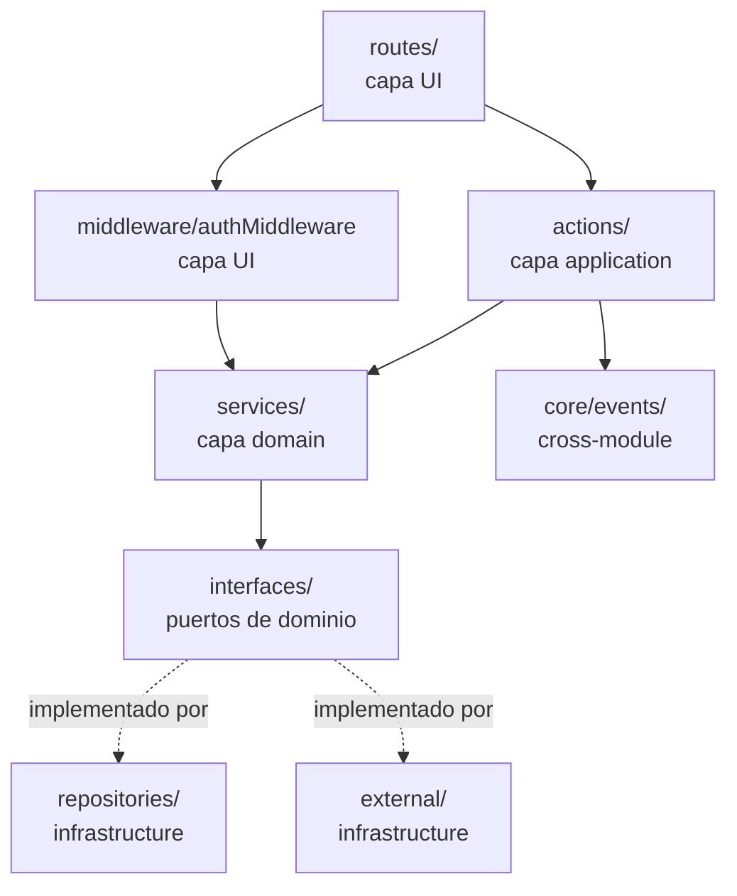

# Design — `auth-foundation`

**Autor**: Sebastián Illa
**Cambio**: `auth-foundation`
**Estado**: borrador · **Creado**: 2026-06-09
**Upstream**: `openspec/changes/auth-foundation/proposal.md` (aprobada)
**Spec**: `openspec/specs/auth/spec.md`

## Arquitectura — vista general

El módulo `auth` sigue la arquitectura modular + clean del proyecto
(ver skill `architecture-standards`). La dirección de dependencias
es estricta: `UI → Application → Domain ← Infrastructure`. La capa
de dominio (`src/modules/auth/domain/**`) no sabe nada de
application, infrastructure ni UI. La comunicación cross-module
ocurre exclusivamente a través de `core/events/` (el evento
`UserRegistered`), nunca vía imports directos.



Layout del módulo:

```
src/modules/auth/
├── domain/
│   ├── entities/
│   │   ├── user.ts
│   │   ├── refresh-token.ts
│   │   └── oauth-account.ts
│   ├── services/
│   │   ├── auth.service.ts
│   │   ├── password.service.ts
│   │   ├── token.service.ts
│   │   └── oauth.service.ts
│   └── interfaces/
│       ├── user.repository.port.ts
│       ├── refresh-token.repository.port.ts
│       └── oauth-account.repository.port.ts
├── application/
│   ├── actions/
│   │   ├── register.action.ts
│   │   ├── login.action.ts
│   │   ├── refresh.action.ts
│   │   ├── logout.action.ts
│   │   ├── me.action.ts
│   │   └── oauth-callback.action.ts
│   └── dto/
│       ├── register.dto.ts
│       ├── login.dto.ts
│       ├── refresh.dto.ts
│       ├── logout.dto.ts
│       └── oauth-callback.dto.ts
├── infrastructure/
│   ├── repositories/
│   │   ├── user.repository.ts
│   │   ├── refresh-token.repository.ts
│   │   └── oauth-account.repository.ts
│   └── external/
│       ├── google-oauth.client.ts
│       ├── argon2.hasher.ts
│       └── jose.jwt.ts
├── middleware/
│   └── auth.middleware.ts
└── index.ts                 # API pública
```

`src/modules/auth/index.ts` exporta la superficie pública: el
montaje de rutas, el `authMiddleware`, el wrapper `requireAuth`, y
la firma del constructor de `AuthService` para tests. Nada más en
el codebase se mete en los internos del módulo.

## Decisiones de librerías

### Hashing de passwords — Argon2id

**Elegida**: `@node-rs/argon2` (binding de Rust, funciona sobre
la capa de compatibilidad NAPI de Bun). Evitamos a propósito
`bun-argon2` hasta que madure más allá de 0.1; también evitamos
`argon2-browser` puro JS porque su presupuesto de performance no
alcanza 50–100 ms con el set de parámetros que queremos.

**Alternativas consideradas**:

- `bcrypt` — rechazada. El estándar del proyecto es Argon2id;
  bcrypt es anterior al requerimiento de memory-hardness y la
  propuesta manda Argon2id (BR-AUTH-03).
- `node-argon2` (el binding canónico de Node) — rechazada por el
  eje de compatibilidad con Bun; `@node-rs/argon2` publica binarios
  NAPI pre-construidos que cargan de forma confiable en Bun.
- `bun-argon2` — re-evaluar en 90 días. Si publica un 1.0 y
  benchmarkea dentro de ±15 % de `@node-rs/argon2` en la VM
  1-CPU de Fly.io, cambiar.
- scrypt propio — rechazado. scrypt es aceptable pero la
  propuesta es explícita sobre Argon2id; ninguna evidencia nueva
  en la propuesta justifica un swap.

**Driver de la decisión**: BR-AUTH-03 (propuesta) + skill
`auth-rbac` ("nunca armes tu propia crypto"). El skill marca bcrypt
cost ≥ 12 como piso; lo superamos yendo a Argon2id de lleno.

**Elección de parámetros (a benchmarkear durante apply)**:

| Parámetro    | Valor objetivo | Fundamento |
|--------------|----------------|------------|
| `memoryCost` | 19456 KiB (19 MiB) | Piso OWASP 2024 para Argon2id en VMs 1-CPU. |
| `timeCost`   | 2 iteraciones    | Con 19 MiB cae ~50–80 ms en Fly.io shared-cpu-1x. |
| `parallelism`| 1                | VM 1-CPU; no hay beneficio de threading.    |

**Gate de benchmark**: un script `bun scripts/bench-argon2.ts`
mide el tiempo de hash en la VM objetivo. Si el p50 está fuera de
50–100 ms, retuneamos `timeCost` (1, 2, 3) antes de salir. La
decisión se registra en el archivo de apply-progress con el tiempo
medido.

### JWT — `jose`

**Elegida**: `jose` (la librería moderna de JWS/JWE/JWK de Panva,
funciona en Bun, soporta todos los algoritmos JWS, ESM-first,
auditada).

**Alternativas consideradas**:

- `jsonwebtoken` (auth0) — rechazada. La librería está en modo
  mantenimiento, tiene CVEs abiertos contra versiones viejas y no
  funciona limpia con el loader ESM de Bun.
- `fast-jwt` — rechazada. Más rápida en Node, pero
  `@panva/jose` es el estándar de facto en el ecosistema TS/Bun y
  el historial de auditoría de seguridad es bien conocido.

**Driver de la decisión**: spec §Garantías de seguridad
(verificación de JWT con pin de `alg` a `HS256`); skill
`security-owasp` (no libs de crypto deprecadas). El
`jwtVerify(token, key, { algorithms: ['HS256'] })` de `jose` es
exactamente la forma que necesitamos para rechazar `alg: none`.

### Cliente OAuth — `arctic` para state/URL, `fetch` directo para el canje

**Elegida**: `arctic` para los helpers de Google OAuth
(generación de state, construcción de authorize URL, helpers de
cookie de state si se necesitan). Para el **canje del token** y el
**fetch de userinfo** usamos el `fetch` de la plataforma. Esto
mantiene la superficie de integración chica, nos permite surfacear
los códigos de error de Google con precisión (el spec distingue
`oauth_code_expired`, `oauth_token_revoked`, `oauth_userinfo_failed`),
y saca una capa de drift de dependencias.

**Alternativas consideradas**:

- `google-auth-library` (SDK first-party de Google) — rechazada
  para MVP. Arrastra un árbol de dependencias grande, expone una
  superficie enorme que no necesitamos, y en el pasado viene
  atrasado en soporte de Bun. La revisitamos si Google suma una
  feature (ej. enforcement de PKCE) que quede más fácil de
  expresar vía el SDK.
- `arctic` end-to-end — **casi** elegida. `arctic` v2 agregó un
  provider Google con helpers built-in para el canje de token y
  userinfo. Lo adoptamos para los helpers de state/URL; leemos su
  fuente para confirmar el wire format, pero llamamos a los
  endpoints de Google directamente para mantener el mapeo de
  errores (la lista exhaustiva de errores OAuth del spec) en
  nuestro código y no detrás de una abstracción genérica de
  "error de Google".
- Hecho a mano (sin librería) — rechazado. La generación de
  state de `arctic` está bien testeada y es más difícil de hacer
  bien de lo que parece. La conservamos para esa pieza.

**Driver de la decisión**: spec §Endpoints `GET /auth/oauth/google`
y `GET /auth/oauth/google/callback` (necesitamos state CSRF,
necesitamos mapeo preciso de códigos de error). Skill
`security-owasp` (no crypto a mano).

### Random y hashing — Web Crypto

**Elegida**: Web Crypto API (`crypto.getRandomValues` para los
refresh tokens y el `state` de OAuth, `crypto.subtle.digest('SHA-256', ...)`
para el fingerprint del refresh token). Cero dependencias nuevas.

**Alternativas consideradas**: `node:crypto` en Bun — funciona,
pero la superficie de Web Crypto alcanza y está estandarizada; el
codebase queda portable si alguna vez corremos en runtimes de
edge.

**Driver de la decisión**: skill `security-owasp` ("usá librerías
probadas, nunca armes tu propia crypto"). Web Crypto *es* la
librería probada para sha256/random en el ecosistema JS moderno.

### Validación de schemas — `zod`

**Elegida**: `zod` para todo body de request, query string y el
schema de variables de entorno al arranque.

**Alternativas consideradas**: `valibot` (más liviana, modular)
— considerada. Estandarizamos en `zod` para MVP porque el
ecosistema (generadores de OpenAPI, formato de mensajes de error)
es más maduro, y el argumento de bundle size es débil para un
proyecto server-only.

**Driver de la decisión**: skill `env-config` (validación con
Zod al arranque); skill `api-design` (validación de body de
request); skill `error-handling` (`VALIDATION_ERROR` carga la lista
de issues de Zod como `details`).

## Forma del middleware

El `authMiddleware` extrae el access JWT, lo verifica con
`jose.jwtVerify` contra `JWT_SECRET` (pineado a `HS256`), y
adjunta la proyección `User` a `req.context.user`. Arroja
`AppError(401, 'UNAUTHORIZED', 'Authentication required')` ante
cualquier falla.

```ts
// src/modules/auth/middleware/auth.middleware.ts
import { jwtVerify } from 'jose';
import { AppError } from '@/core/errors/app-error';
import type { User } from '@/modules/auth/domain/entities/user';
import type { UserRepositoryPort } from '@/modules/auth/domain/interfaces/user.repository.port';
import { env } from '@/config/env';

export interface AuthenticatedContext {
  user: User;
  user_id: string;
}

export async function authMiddleware(
  req: Request,
  userRepository: UserRepositoryPort,
): Promise<AuthenticatedContext> {
  const header = req.headers.get('Authorization');
  if (!header) {
    throw new AppError('Authentication required', 'UNAUTHORIZED', 401);
  }

  const [scheme, token] = header.split(' ');
  if (scheme !== 'Bearer' || !token) {
    throw new AppError('Authentication required', 'UNAUTHORIZED', 401);
  }

  let payload: { sub: string };
  try {
    const result = await jwtVerify(token, new TextEncoder().encode(env.JWT_SECRET), {
      algorithms: ['HS256'],
    });
    payload = result.payload as { sub: string };
  } catch {
    throw new AppError('Authentication required', 'UNAUTHORIZED', 401);
  }

  const user = await userRepository.findById(payload.sub);
  if (!user) {
    throw new AppError('Authentication required', 'UNAUTHORIZED', 401);
  }

  return { user, user_id: user.id };
}

export function requireAuth<T extends (...args: any[]) => any>(handler: T): T {
  // Syntactic sugar para rutas: envuelve el handler de modo que
  // el contexto garantice llevar `user` y `user_id`. La
  // implementación depende del router elegido; para Bun.serve +
  // router custom, inyecta `userRepository` desde el container de DI.
  return handler;
}
```

Propiedades clave:

- El ataque `alg: none` se rechaza pineando `algorithms: ['HS256']`.
- El lookup de `sub` es la única lectura a DB; el resto es CPU pura.
- El error siempre es
  `AppError(401, 'UNAUTHORIZED', 'Authentication required')`
  sin importar la causa (falta, malformado, expirado, firma
  inválida, usuario desconocido). Esto evita leakear qué check
  falló.

## Algoritmo de rotación de refresh token

La rotación + revocación de familia es la parte crítica de
seguridad del módulo. Recorremos el path feliz, el path de
detección de reuso y el path de refresh expirado.

### Path feliz

```text
function rotate(refreshTokenPlaintext: string):
  tokenHash := sha256(refreshTokenPlaintext)

  BEGIN TRANSACTION
    row := refreshTokenRepo.findByHash(tokenHash)
    IF row IS NULL:
      THROW AppError(401, 'INVALID_TOKEN', ...)

    IF row.expires_at < now():
      THROW AppError(401, 'REFRESH_EXPIRED', ...)

    IF row.revoked_at IS NOT NULL:
      // Path de detección de reuso (abajo).
      THROW AppError(401, 'REFRESH_REVOKED', ...)

    newToken := random32BytesBase64Url()
    newHash  := sha256(newToken)
    newId    := uuidV7()
    familyId := row.family_id

    refreshTokenRepo.insert({
      id: newId,
      user_id: row.user_id,
      token_hash: newHash,
      family_id: familyId,
      issued_at: now(),
      expires_at: now() + REFRESH_TTL_SECONDS,
      revoked_at: NULL,
      replaced_by: NULL,
    })

    refreshTokenRepo.update(row.id, {
      revoked_at: now(),
      replaced_by: newId,
    })
  COMMIT

  user := userRepo.findById(row.user_id)
  accessToken := signAccessToken({ sub: user.id })
  RETURN { access_token, refresh_token: newToken, token_type: 'Bearer', expires_in: 900 }
```

La transacción es obligatoria: el insert de la fila nueva y el
update de la vieja commitean ambos o rollbackean ambos. Un crash
entre los dos le imposibilitaría al usuario refrescar.

### Path de detección de reuso

```text
// Se dispara cuando row.revoked_at IS NOT NULL al presentar.
BEGIN TRANSACTION
  refreshTokenRepo.revokeFamily(row.family_id, revoked_at: now())
  // Opcional: insertar una fila de auditoría 'family_revoked'.
COMMIT

THROW AppError(401, 'REFRESH_REVOKED', ...)
```

`revokeFamily(familyId)` setea `revoked_at = now()` para toda fila
de la familia cuyo `revoked_at` está actualmente en `NULL`. Las
filas ya revocadas quedan como están. La próxima llamada legítima
desde cualquier dispositivo de la familia ve `REFRESH_REVOKED`.

### Path de refresh expirado

```text
// Se dispara cuando row.expires_at < now().
THROW AppError(401, 'REFRESH_EXPIRED', ...)
// Sin revocación de familia: un token expirado no es evidencia de robo.
```

**No** revocamos la familia por expiración. El token simplemente
superó su TTL; el usuario legítimo puede re-loguearse desde el
mismo dispositivo sin perder sesiones en otros dispositivos.

### Concurrencia

Dos refreshes concurrentes con el mismo token producen:

- Ambos leen la misma `row`.
- Uno gana el `UPDATE`; el otro ve su `UPDATE` exitoso también
  (SQLite serializa los writes), pero el segundo `INSERT`
  reusaría el mismo `token_hash` solo sobre la misma fila. Con
  el unique index sobre `token_hash` más la transacción, el
  perdedor inserta una nueva fila apuntando a una fila que acaba
  de marcar `revoked_at = now`. Desde la perspectiva del
  perdedor, la segunda llamada devuelve el par nuevo y la
  respuesta de la primera ya fue consumida.

Un patrón más seguro es marcar la fila con `revoked_at = now`
*como primera sentencia dentro de la transacción*, de modo que
un reader concurrente la vea revocada y caiga en el path de
detección de reuso. Adoptamos este patrón: el update corre antes
del insert. El perdedor concurrente entra al path de detección
de reuso y la familia se auto-revoca. Este es el outcome
correcto: dos clientes presentando el mismo refresh token es
en sí una señal de robo, aun si los dos son "legítimos".

## Algoritmo del flow OAuth

### `startGoogleOAuth`

```text
function startGoogleOAuth():
  state := random32BytesBase64Url()
  signedState := signHmacSha256(state, COOKIE_SECRET)
  // Guardamos el state raw en la cookie; el HMAC protege la integridad.
  setCookie({
    name: 'oauth_state',
    value: signedState,
    httpOnly: true,
    secure: true,            // omitir en dev local
    sameSite: 'Lax',
    path: '/auth/oauth/google/callback',
    maxAge: 600,             // 10 minutos
  })

  authorizeUrl := buildGoogleAuthorizeUrl({
    client_id:     env.GOOGLE_CLIENT_ID,
    redirect_uri:  env.GOOGLE_REDIRECT_URI,
    response_type: 'code',
    scope:         'openid email profile',
    state:         signedState,
    prompt:        'select_account',  // siempre fuerza el account chooser
  })

  return redirect(302, authorizeUrl)
```

### `handleGoogleCallback`

```text
function handleGoogleCallback(query, cookies):
  signedState := cookies['oauth_state']
  IF !signedState:
    return redirect(302, '${APP_URL}/login?error=oauth_state_mismatch')

  // Verificamos el HMAC; el state raw en la cookie es igual a lo
  // que el browser va a hacer eco en el query. Comparamos el
  // valor firmado de la cookie con el state del query.
  IF !verifyHmacSha256(query.state, COOKIE_SECRET):
    return redirect(302, '${APP_URL}/login?error=oauth_state_mismatch')

  clearCookie('oauth_state', path: '/auth/oauth/google/callback')

  // 1. Canje de code por tokens
  tokenResponse := fetch(GOOGLE_TOKEN_ENDPOINT, {
    method: 'POST',
    headers: { 'Content-Type': 'application/x-www-form-urlencoded' },
    body: formUrlEncode({
      code:          query.code,
      client_id:     env.GOOGLE_CLIENT_ID,
      client_secret: env.GOOGLE_CLIENT_SECRET,
      redirect_uri:  env.GOOGLE_REDIRECT_URI,
      grant_type:    'authorization_code',
    }),
  })
  IF tokenResponse.status === 400:
    return redirect(302, '${APP_URL}/login?error=oauth_code_expired')
  IF tokenResponse.status === 401 OR 403:
    return redirect(302, '${APP_URL}/login?error=oauth_token_revoked')
  IF tokenResponse.status >= 500:
    return 502 con Retry-After; loguear; después redirect con oauth_provider_unavailable
  IF !tokenResponse.ok:
    return redirect(302, '${APP_URL}/login?error=oauth_userinfo_failed')

  tokens := await tokenResponse.json()
  accessToken := tokens.access_token

  // 2. Fetch de userinfo
  userinfoResponse := fetch(GOOGLE_USERINFO_ENDPOINT, {
    headers: { Authorization: 'Bearer ${accessToken}' },
  })
  // Mismo manejo de status que arriba, colapsado.
  IF !userinfoResponse.ok:
    return redirect(302, '${APP_URL}/login?error=oauth_userinfo_failed')

  profile := await userinfoResponse.json()
  IF !profile.email:
    return redirect(302, '${APP_URL}/login?error=oauth_email_missing')
  IF profile.email_verified !== true:
    return redirect(302, '${APP_URL}/login?error=oauth_email_unverified')

  normalizedEmail := profile.email.trim().toLowerCase()

  // 3. Find or create user, link oauth_accounts
  BEGIN TRANSACTION
    user := userRepo.findByEmail(normalizedEmail)
    IF user IS NULL:
      user := userRepo.insert({
        id:               uuidV7(),
        email:            normalizedEmail,
        password_hash:    NULL,
        email_verified:   true,
        default_provider: 'google',
      })
      emitEvent({ type: 'UserRegistered', payload: { user_id: user.id, email: normalizedEmail, provider: 'google', occurred_at: now() } })
    END

    // Vincular oauth_accounts. El unique constraint nos protege.
    TRY:
      oauthAccountRepo.insert({
        id:               uuidV7(),
        user_id:          user.id,
        provider:         'google',
        provider_subject: profile.sub,
        provider_email:   normalizedEmail,
      })
    CATCH unique_violation:
      ROLLBACK
      // El (provider, provider_subject) ya está vinculado. Si
      // está vinculado al mismo usuario, seguimos (re-login); si
      // está vinculado a un usuario distinto, error.
      existing := oauthAccountRepo.findByProviderSubject('google', profile.sub)
      IF existing.user_id !== user.id:
        return redirect(302, '${APP_URL}/login?error=oauth_subject_taken')
      // Mismo usuario: re-login, cae a la emisión de tokens.
  COMMIT

  // 4. Emitir tokens
  refreshToken := random32BytesBase64Url()
  familyId     := uuidV7()
  refreshTokenRepo.insert({
    id:          uuidV7(),
    user_id:     user.id,
    token_hash:  sha256(refreshToken),
    family_id:   familyId,
    issued_at:   now(),
    expires_at:  now() + REFRESH_TTL_SECONDS,
    revoked_at:  NULL,
    replaced_by: NULL,
  })
  accessToken := signAccessToken({ sub: user.id })

  return redirect(302,
    '${APP_URL}/auth/success#access_token=${accessToken}&refresh_token=${refreshToken}')
```

El `try/catch` alrededor del `oauthAccountRepo.insert` es la
brecha intencional a la guía de "no lógica en tests" /
"happy-path en línea recta": el spec obliga a una respuesta
distinta según si la fila conflictiva de `oauth_accounts` apunta
al mismo usuario o a uno distinto. Los tests parametrizan los dos
casos (sin `if/else` en los bodies de los tests — solo en la
implementación).

## Manejo de errores

El módulo adopta la clase `AppError` del skill `error-handling`:

```ts
// src/core/errors/app-error.ts
export class AppError extends Error {
  constructor(
    message: string,
    public code: string,
    public statusCode: number = 500,
    public details?: unknown,
  ) {
    super(message);
    this.name = this.constructor.name;
  }
}
```

El mapa de código de error del spec a instancia de `AppError` es
exhaustivo y vive en las actions de la capa de application. El
central error handler en `core/http/error-handler.ts` convierte
`AppError` en la forma estándar de respuesta de error:

```json
{ "error": { "code": "INVALID_CREDENTIALS", "message": "Invalid credentials." } }
```

El path de validación usa `details` para cargar la lista de
issues de Zod:

```json
{ "error": { "code": "VALIDATION_ERROR", "message": "The submitted data is not valid.", "details": [...] } }
```

`UserRegistered` y el `code` de OAuth **nunca** se loguean.
`password` y `refresh_token` se strippean de cualquier llamada al
logger por una allow-list de campos seguros en el middleware de
logging.

## Schema de base de datos

Schema de Drizzle para las tres tablas. Los UUIDs se guardan como
`text` (string uuid v7); los timestamps son unix seconds (modo
`integer`) para matchear el spec.

```ts
// src/modules/auth/infrastructure/schema.ts
import { sqliteTable, text, integer, index, uniqueIndex } from 'drizzle-orm/sqlite-core';

export const users = sqliteTable(
  'users',
  {
    id: text('id').primaryKey(),                          // uuid v7
    email: text('email').notNull().unique(),             // lowercased, trimmed
    passwordHash: text('password_hash'),                 // nullable para Google-only
    emailVerified: integer('email_verified', { mode: 'boolean' }).notNull().default(false),
    defaultProvider: text('default_provider', { enum: ['local', 'google'] }).notNull(),
    createdAt: integer('created_at').notNull(),
    updatedAt: integer('updated_at').notNull(),
  },
  (t) => ({
    emailIdx: uniqueIndex('users_email_unique').on(t.email),
  }),
);

export const refreshTokens = sqliteTable(
  'refresh_tokens',
  {
    id: text('id').primaryKey(),                         // uuid v7
    userId: text('user_id').notNull().references(() => users.id),
    tokenHash: text('token_hash').notNull(),              // sha256 hex
    familyId: text('family_id').notNull(),               // uuid v7
    issuedAt: integer('issued_at').notNull(),
    expiresAt: integer('expires_at').notNull(),
    revokedAt: integer('revoked_at'),                    // nullable
    replacedBy: text('replaced_by'),                     // nullable
  },
  (t) => ({
    userIdx: index('refresh_tokens_user_id_idx').on(t.userId),
    tokenHashUnique: uniqueIndex('refresh_tokens_token_hash_unique').on(t.tokenHash),
    familyIdx: index('refresh_tokens_family_id_idx').on(t.familyId),
  }),
);

export const oauthAccounts = sqliteTable(
  'oauth_accounts',
  {
    id: text('id').primaryKey(),                         // uuid v7
    userId: text('user_id').notNull().references(() => users.id),
    provider: text('provider', { enum: ['google'] }).notNull(),
    providerSubject: text('provider_subject').notNull(),
    providerEmail: text('provider_email').notNull(),
    createdAt: integer('created_at').notNull(),
  },
  (t) => ({
    providerSubjectUnique: uniqueIndex('oauth_accounts_provider_subject_unique').on(t.provider, t.providerSubject),
    userIdx: index('oauth_accounts_user_id_idx').on(t.userId),
  }),
);
```

Elección de índices:

- `users.email` — único (el spec manda igualdad case-insensitive;
  la capa de storage lowercasa al escribir).
- `refresh_tokens.token_hash` — único (el lookup de rotación es
  `findByHash`).
- `refresh_tokens.user_id` y `refresh_tokens.family_id` —
  indexados para la query de cascade-revocation y cualquier feature
  futura de "listar sesiones de este usuario".
- `oauth_accounts(provider, provider_subject)` — único
  (BR-AUTH-12).
- `oauth_accounts.user_id` — indexado para el lookup de auto-link
  "¿ya tengo una cuenta Google para este usuario?".

Usamos `text` para las columnas `id` porque uuid v7 entra en
36 chars y nos da ids controlados por el server sin una sequence
de DB. Timestamps `integer` en unix seconds son simples de
comparar y portables a migraciones de schema futuras.

## Migraciones

Usamos la herramienta de migraciones versionadas de Drizzle
(`drizzle-kit generate` → `drizzle-kit migrate`). El cambio
`auth-foundation` publica un único archivo de migración
(`db/migrations/0001_auth_foundation.sql`) generado por
`drizzle-kit` desde el schema de arriba. **No** autoramos a mano
el SQL de la migración — el schema es la fuente de verdad y la
migración se genera (skill `database-strategy`: "migraciones
versionadas, sin SQL manual en el código de la app").

La migración crea las tres tablas y sus índices en orden de
dependencia: primero `users`, después `refresh_tokens` y
`oauth_accounts` (las dos referencian `users.id`). Las
down-migraciones no entran en el alcance de MVP; las
re-introducimos cuando el cambio `fly-deploy` arme el pipeline de
CI que las necesite.

## Variables de entorno

Validadas al arranque con un schema de Zod (skill `env-config`).
Cualquier valor faltante o mal formado falla rápido con un error
claro.

```ts
// src/config/env.schema.ts
import { z } from 'zod';

const envSchema = z.object({
  NODE_ENV: z.enum(['development', 'test', 'production']),

  DATABASE_URL: z.string().min(1),

  JWT_SECRET: z.string().min(32, 'JWT_SECRET must be at least 32 bytes'),
  JWT_ACCESS_TTL_SECONDS: z.coerce.number().int().positive().default(900),

  REFRESH_TTL_SECONDS: z.coerce.number().int().positive().default(60 * 60 * 24 * 30),  // 30 días

  COOKIE_SECRET: z.string().min(32, 'COOKIE_SECRET must be at least 32 bytes'),

  GOOGLE_CLIENT_ID: z.string().min(1),
  GOOGLE_CLIENT_SECRET: z.string().min(1),
  GOOGLE_REDIRECT_URI: z.string().url(),

  APP_URL: z.string().url(),

  PORT: z.coerce.number().int().positive().default(3000),
});

export const env = envSchema.parse(process.env);
```

**Validación cross-field** (vive en el módulo de env, no en las
reglas per-field de Zod): al arranque assertamos que
`new URL(env.GOOGLE_REDIRECT_URI).origin === new URL(env.APP_URL).origin`.
Un mismatch significa que el callback de OAuth va a ser rechazado
por Google o por el scoping de path de nuestra propia cookie
`state`, y no hay manera de descubrirlo en runtime sin probar un
viaje OAuth real.

`.env.example` (commiteado) carga las mismas keys con valores
vacíos. `.env` y `.env.production` están en `.gitignore`; los
secrets de producción viven en Fly secrets (encrypted at rest).

## Estrategia de testing

Por el skill `testing-standards`: patrón AAA, sin `if`/`else`/`for`
dentro de los bodies de tests, parametrizado donde haga falta,
≥80 % de coverage de línea + branch en el módulo `auth`. TDD
estricto: corremos `bun test` después de cada cambio; los tests se
escriben antes de la implementación que pinean.

### Tests unitarios (servicios de dominio)

Ubicados en `src/modules/auth/domain/{service}.test.ts`. Funciones
puras, sin DB, sin HTTP.

| Suite                                  | Qué cubre                                                                                                    |
|----------------------------------------|--------------------------------------------------------------------------------------------------------------|
| `PasswordService`                      | hash/verify con los parámetros Argon2id elegidos; rechaza passwords incorrectas; constant-time dummy en email faltante. |
| `TokenService`                         | sign/verify del access JWT; pin de `alg: HS256`; rechaza `alg: none`; rechaza tokens expirados; rechaza firmas con secret equivocado. |
| `RefreshTokenService`                  | path feliz de rotación; revocación de familia en cascada ante reuso; path de refresh expirado; race de rotación concurrente (parametrizado). |
| `OAuthService`                         | generación de state; sign/verify HMAC; construcción de authorize URL con todos los params requeridos.         |
| `AuthService` (orquestador, ports mockeados) | register feliz/conflicto; tres modos de falla de login; logout; me. Sin `if/else` en bodies de tests — tablas parametrizadas. |

### Tests de integración (rutas + repos + DB)

Ubicados en `src/modules/auth/infrastructure/{module}.repository.test.ts`
y `src/modules/auth/application/{action}.action.test.ts`. La DB
de test es un archivo SQLite fresco por suite (vía `:memory:`
para velocidad). No mockeamos los repos en los tests de
integración; mockeamos solo las fronteras externas (Google OAuth,
el reloj del sistema).

| Suite                                    | Qué cubre                                                                                          |
|------------------------------------------|----------------------------------------------------------------------------------------------------|
| `UserRepository`                         | insert, findById, findByEmail, findByEmail (case-insensitive después de normalizar a lowercase).   |
| `RefreshTokenRepository`                 | insert, findByHash, revokeFamily (cascada), findByFamily.                                          |
| `OAuthAccountRepository`                 | insert, findByProviderSubject, unique-violation en (provider, provider_subject).                   |
| `RegisterAction`                         | 201 path exitoso; 409 `EMAIL_TAKEN` con timing comparable; 400 `PASSWORD_TOO_SHORT`; 400 `INVALID_EMAIL`. |
| `LoginAction`                            | 200 éxito; 401 para email desconocido, password incorrecta, usuario Google-only — todos con forma idéntica y timing similar. |
| `RefreshAction`                          | 200 rotación; 401 `REFRESH_REVOKED` dispara cascada de familia; 401 `REFRESH_EXPIRED`; 401 `INVALID_TOKEN`. |
| `LogoutAction`                           | 204 con token válido; 401 con desconocido; sin cascada.                                            |
| `MeAction`                               | 200 con `PublicUser`; 401 con JWT faltante/expirado.                                               |
| `OAuthCallbackAction`                    | path feliz; state mismatch; `email_verified: false`; subject ya vinculado a usuario distinto; mismo usuario (re-login); provider 5xx. |

### Tests de seguridad

Ubicados en `src/modules/auth/__tests__/security/*.test.ts`. Son
tests de integración pero viven en una carpeta dedicada para que
el reviewer los pueda auditar de una pasada.

| Test                                      | Qué prueba                                                                                          |
|-------------------------------------------|-----------------------------------------------------------------------------------------------------|
| `login.timing.test.ts`                    | El tiempo de respuesta para "email no encontrado" es estadísticamente indistinguible de "password incorrecta" (sample size y threshold documentados en el test). |
| `refresh.reuse.test.ts`                   | Un refresh revocado no se puede reusar; la familia se revoca atómicamente; requests concurrentes con el mismo refresh fallan de forma segura. |
| `oauth.state-csrf.test.ts`                | Un callback con cookie `state` mismatch, faltante o expirada redirige a `oauth_state_mismatch`; no se crea usuario; no se inserta fila de `oauth_accounts`. |
| `jwt.algorithm-confusion.test.ts`         | Un token con `alg: none` se rechaza; un token con `alg: RS256` firmado con el secret HS256 se rechaza. |
| `secrets.in-logs.test.ts`                 | Un request que incluye `password`, `refresh_token`, header `Authorization` o query `code` no hace que ninguno de esos valores aparezca en la salida capturada del log. |

### Gate de coverage

`bun test --coverage` corre en CI. El coverage de línea + branch
del módulo `auth` debe ser ≥ 80 % para mergear (regla del skill
`testing-standards` "mínimo 80 % en domain + application"). El
coverage real alcanzado se registra en el verify-report.

## Preguntas abiertas para el padre

- **Refresh ante cambio de password**: la propuesta lista
  "revocar todos los refresh tokens ante cambio de password" como
  comportamiento *default-if-not-answered*. No hay endpoint de
  cambio de password en este cambio, pero el helper
  `RefreshTokenRepository.revokeFamily` es la primitiva que
  necesitaríamos. Confirmar: ¿queremos este comportamiento
  embebido desde el día uno (un poquito de trabajo extra, requiere
  un helper `revokeAllForUser(user_id)`), o diferido a un cambio
  posterior de `password-management`?

  *Default si no se contesta*: diferir. No tenemos endpoint de
  cambio de password todavía, así que el helper sería código
  muerto en este cambio.

- **Updates de `oauth_accounts.provider_email`**: la propuesta
  dice "sí (audit trail)" pero el spec solo se compromete a "el
  valor más recientemente observado". Podemos implementar
  cualquiera de estas:

  1. Updatear `provider_email` en cada callback de OAuth exitoso
     (mantiene fresco el audit trail; write extra muy chico).
  2. Insertar una nueva fila de `oauth_account_audit` en cada
     callback exitoso, dejando `provider_email` inmutable después
     del primer write (preserva el valor de "al momento del
     link"; más filas).
  3. No hacer nada en callbacks subsiguientes, solo setear el
     valor al momento del link (la lectura más simple del spec).

  *Default si no se contesta*: opción 1 (update in place). El
  audit trail vive en `provider_email` mismo; la tabla de
  auditoría alternativa es un cambio separado.

- **Parámetro `prompt` de OAuth**: por default usamos
  `prompt=select_account` en la authorize URL (siempre muestra el
  account chooser). Las alternativas son `prompt=none` para
  re-auth silenciosa y `prompt=consent` para mostrar siempre la
  pantalla de consentimiento. Confirmar que `select_account` es el
  default correcto para la UX que queremos; si la UI después
  quiere re-auth silenciosa al re-login, lo revisitamos.

  *Default si no se contesta*: mantener `prompt=select_account`.

- **No hay más ambigüedades abiertas de spec o design.** Las
  decisiones de librería están todas driven por la propuesta + los
  skills; los gates de implementación (benchmark, GGA, review
  adversarial) ya están en los checklists de apply y verify.
