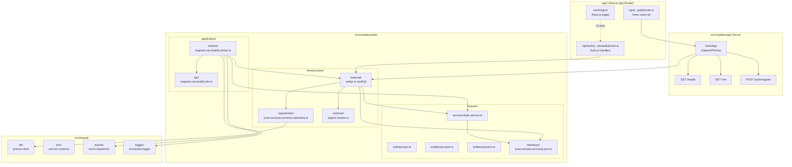

# Architecture — gastos-personales

> The architecture overview for `gastos-personales`. The
> project follows **modular + clean architecture** (see
> `architecture-standards` skill). The dependency direction
> is strict: `UI → Application → Domain ← Infrastructure`.
> Cross-module communication happens exclusively through
> `src/shared/events/`, never via direct imports.
>
> The Auth section below documents the `auth-foundation`
> change (Next.js 16 + Auth.js v5 + Prisma 6 + Hono catch-all
>
> - PostgreSQL). The full design is at
>   `openspec/changes/auth-foundation/design.md`; this page
>   is the at-a-glance map for engineers joining the project.

## Auth

The `auth` module lands the full identity layer for
`gastos-personales`. It owns 4 Prisma-managed tables
(`User`, `Account`, `Session`, `VerificationToken`) on
PostgreSQL (Neon in dev/prod, testcontainers in CI), an
Argon2id-hashed Credentials provider, Google OAuth 2.0 with
email-match auto-link, a 30-day database session strategy
with a 24-hour sliding window, and a Hono catch-all that
hosts the non-auth application API at `/api/*` alongside
Auth.js's `/api/auth/*`.

### High-level architecture

**Layer responsibilities** (the dependency direction is
strict: `UI → Application → Domain ← Infrastructure`):

- **`app/`** (UI) — Next.js App Router pages, layouts,
  server components, and the two API route handlers. Owns
  no business logic.
- **`src/modules/api/`** (UI-shaped) — Hono `OpenAPIHono`
  instance at `app/api/[...path]/route.ts`. Calls
  application actions.
- **`src/modules/auth/`** — domain (entities, services,
  ports), application (actions, DTOs), infrastructure
  (repositories, Argon2id wrapper, Auth.js config).
- **`src/shared/`** — cross-cutting infrastructure: Prisma
  client, env schema (Zod), in-process event dispatcher,
  structured logger.

### Data model

Four Prisma models, owned by `prisma/schema.prisma`. Three
columns are added to `User` on top of the canonical Auth.js
schema: `passwordHash` (BR-AUTH-3, BR-AUTH-9),
`defaultProvider` (BR-AUTH-13), and `lastLoginAt`
(stamped by the `signIn` callback).

> **`lastLoginAt` is best-effort, not a gate.** The `signIn`
> callback always returns `true` after attempting the audit
> write. A failure to stamp `lastLoginAt` (DB error, missing
> row after a provider handshake, edge case in the OAuth
> adapter's upsert) is logged and the user is NOT blocked.
> Blocking an already-authenticated user because of an
> audit-trail write failure is the wrong trade-off. The
> callback looks up the row by `email` (stable across provider
> and DB) and uses `updateMany` so a missing row is a soft
> warning rather than a Prisma P2025 exception. The `signIn`
> callback is exported as `signInCallback` from
> `src/modules/auth/infrastructure/external/authjs.ts` and has
> direct unit coverage in
> `authjs.signin-callback.test.ts` (4 branches). Rationale +
> commit: `d20c8c3` (`fix(auth): unblock Google OAuth
sign-in flow`) and `07e3b57` (`fix(auth): callback tests,
open-redirect allowlist, email normalization, error UX`).

| Model               | Purpose                                                                                             | Key constraints                                                      |
| ------------------- | --------------------------------------------------------------------------------------------------- | -------------------------------------------------------------------- |
| `User`              | Identity anchor; carries credentials + profile.                                                     | `email @unique`, `@@index([createdAt])`                              |
| `Account`           | OAuth linkage; one row per `(provider, providerAccountId)`.                                         | `@@unique([provider, providerAccountId])` (BR-AUTH-10)               |
| `Session`           | Database session row (no JWT in the cookie).                                                        | `sessionToken @unique`, `@@index([expires])` (for the future GC job) |
| `VerificationToken` | Email verification / password-reset tokens (empty in MVP; the `email-verification` change owns it). | `@@unique([identifier, token])`                                      |

Indexes: `User.email` is `@unique` (the `findUnique` query
in the Credentials `authorize()` is the primary access
pattern). `Account(provider, providerAccountId)` is
`@@unique` — the BR-AUTH-10 line of defense against the
"same Google account linked to two users" attack.
`Session.sessionToken` is `@unique` (looked up on every
`auth()` call). `Session.expires` and `User.createdAt`
carry explicit `@@index` for the future GC and
user-deletion bulk queries.

Cascade: `Account.user` and `Session.user` use
`onDelete: Cascade`. The `user-deletion` change owns the
deletion flow; this change ships the schema-level
constraint.

### Routes

**8 Auth.js routes** (mounted at
`app/api/auth/[...nextauth]/route.ts`):

| Method | Path                             | Purpose                            |
| ------ | -------------------------------- | ---------------------------------- |
| GET    | `/api/auth/signin`               | Sign-in page (custom, BR-AUTH-13)  |
| GET    | `/api/auth/signout`              | Sign-out page (custom)             |
| POST   | `/api/auth/callback/credentials` | Credentials provider callback      |
| GET    | `/api/auth/callback/google`      | Google OAuth 2.0 callback          |
| GET    | `/api/auth/session`              | Current session JSON               |
| GET    | `/api/auth/csrf`                 | CSRF token                         |
| GET    | `/api/auth/providers`            | Providers list                     |
| GET    | `/api/auth/verify-request`       | Magic-link landing (unused in MVP) |

**3 Hono routes** (mounted at `app/api/[...path]/route.ts`,
delegated to `honoApp.fetch(request)`):

| Method | Path                 | Auth required                            | Purpose                                    |
| ------ | -------------------- | ---------------------------------------- | ------------------------------------------ |
| GET    | `/api/health`        | no                                       | Liveness probe                             |
| GET    | `/api/me`            | yes (session)                            | Current user's `PublicUser`                |
| POST   | `/api/auth/register` | no (mutating; `origin-check` middleware) | Local signup; emits `UserRegistered` event |

Routing precedence: Next.js's file-based routing resolves
`app/api/auth/[...nextauth]/route.ts` before the Hono
catch-all, so `/api/auth/*` is owned by Auth.js and `/api/*`
is owned by Hono. The catch-all is tested in T-025 (slice
C-1) with one integration test per route.

### Session strategy

- **No JWT.** `session.strategy = 'database'` in `authConfig`
  (T-018). The `authjs.session-token` cookie carries an
  opaque session token; the server resolves the user from
  the `Session` table on every `auth()` call.
- **`session.maxAge = 30 * 24 * 60 * 60`** (30 days). After
  30 days, the session row expires and the user must sign
  in again.
- **`session.updateAge = 24 * 60 * 60`** (24-hour sliding
  window). Auth.js extends the `Session.expires` on every
  `auth()` call, but only if the previous extension was
  more than 24 hours ago. This is the BR-AUTH-7 / decision
  gap #8 default.
- **Sign-out** deletes the `Session` row (BR-AUTH-8). The
  cookie is cleared. A "log out all devices" follow-up is
  out of scope.
- **Cookie attributes** (validated in T-027.6): `HttpOnly`
  and `SameSite=Lax` always; `Secure` in production
  (`NODE_ENV=production`); `Path=/`; the cookie name is
  `authjs.session-token`.

### Auto-link security model

When a user signs in with Google, two cases are possible:

1. **Email match + `email_verified: true`** (auto-link) —
   the existing local `User` row stays; Auth.js inserts an
   `Account` row linking the Google subject to the user.
   `defaultProvider` is **not** mutated (BR-AUTH-13): the
   user keeps `'local'` even after linking Google.
2. **No email match** — Auth.js inserts a new `User` row
   (with `defaultProvider = 'google'`) plus the `Account`
   row. `UserRegistered` is dispatched exactly once.

The composite `@@unique([provider, providerAccountId])` on
`Account` is the BR-AUTH-10 line of defense: a second
Google account with the same `(provider, providerAccountId)`
throws a Prisma `P2002` error. See `docs/adr/0005-auto-link-security-model.md`
for the full rationale and the trade-off analysis.

### Cross-module contracts

- **`auth()` helper** is the only identity-resolution
  path. Every server component, every Hono action, and
  every Next.js proxy imports `auth` from
  `@/modules/auth` (re-exported from
  `src/modules/auth/index.ts`). The internal ports,
  repositories, and services are not exported.
- **`User` is the identity anchor.** Every later change
  (`accounts-ledger`, `transactions`, `reports-mvp`) keys
  its tables on `User.id` (a cuid). Cross-module queries
  use `WHERE user_id = ?`; there is no shared "user
  object" beyond the `User` row.
- **`UserRegistered` event** is dispatched by
  `AuthService.register` exactly once per user, on the
  first registration (local signup or first Google
  signup). Auto-link does **not** dispatch the event. A
  downstream module (e.g. a future `email-verification`
  or `welcome-email` change) subscribes to it.
- **`UserSignedIn` event** is dispatched by the
  `signIn` callback on every successful sign-in. The
  payload includes `userId` and `provider`; downstream
  modules can attach audit logs or analytics.
- **Public API of the auth module**
  (`src/modules/auth/index.ts`): `auth`, `signIn`,
  `signOut`, `handlers` (the `GET` and `POST` for
  `/api/auth/*`), `honoApp` (the `OpenAPIHono` instance
  for the non-auth `/api/*` routes), and the event name
  constants `UserRegistered` and `UserSignedIn`. Nothing
  else in the codebase reaches into the module's
  internals.

### References

- `openspec/changes/auth-foundation/{proposal,design,tasks}.md`
- `openspec/changes/auth-foundation-slice-c/{proposal,design,tasks}.md`
- `docs/adr/0001-authjs-v5.md`
- `docs/adr/0002-prisma-6.md`
- `docs/adr/0003-argon2id-parameters.md`
- `docs/adr/0004-hono-catch-all.md`
- `docs/adr/0005-auto-link-security-model.md`
- `openspec/specs/auth/spec.md` (canonical capability
  spec; this architecture page is the at-a-glance map)
