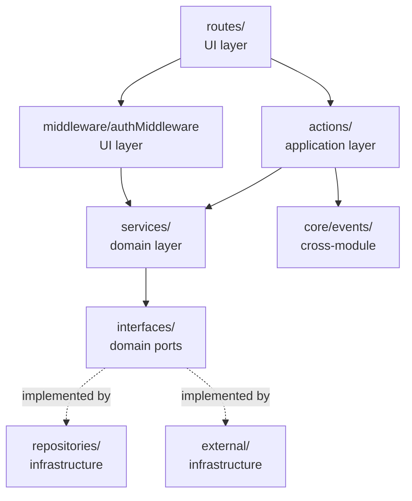

# Design — `auth-foundation`

**Author**: Sebastián Illa
**Change**: `auth-foundation`
**Status**: draft · **Created**: 2026-06-09
**Upstream**: `openspec/changes/auth-foundation/proposal.md` (approved)
**Spec**: `openspec/specs/auth/spec.md`

## Architecture overview

The `auth` module follows the project's modular + clean architecture
(see `architecture-standards` skill). The dependency direction is
strict: `UI → Application → Domain ← Infrastructure`. The domain
layer (`src/modules/auth/domain/**`) knows nothing about
application, infrastructure, or UI. Cross-module communication
happens exclusively through `core/events/` (the
`UserRegistered` event), never via direct imports.



Module layout:

```
src/modules/auth/
├── domain/
│   ├── entities/
│   │   ├── user.ts
│   │   ├── refresh-token.ts
│   │   └── oauth-account.ts
│   ├── services/
│   │   ├── auth.service.ts
│   │   ├── password.service.ts
│   │   ├── token.service.ts
│   │   └── oauth.service.ts
│   └── interfaces/
│       ├── user.repository.port.ts
│       ├── refresh-token.repository.port.ts
│       └── oauth-account.repository.port.ts
├── application/
│   ├── actions/
│   │   ├── register.action.ts
│   │   ├── login.action.ts
│   │   ├── refresh.action.ts
│   │   ├── logout.action.ts
│   │   ├── me.action.ts
│   │   └── oauth-callback.action.ts
│   └── dto/
│       ├── register.dto.ts
│       ├── login.dto.ts
│       ├── refresh.dto.ts
│       ├── logout.dto.ts
│       └── oauth-callback.dto.ts
├── infrastructure/
│   ├── repositories/
│   │   ├── user.repository.ts
│   │   ├── refresh-token.repository.ts
│   │   └── oauth-account.repository.ts
│   └── external/
│       ├── google-oauth.client.ts
│       ├── argon2.hasher.ts
│       └── jose.jwt.ts
├── middleware/
│   └── auth.middleware.ts
└── index.ts                 # public API
```

`src/modules/auth/index.ts` exports the public surface: route
mounting, the `authMiddleware`, the `requireAuth` wrapper, and the
`AuthService` constructor signature for testing. Nothing else in the
codebase reaches into the module's internals.

## Library decisions

### Password hashing — Argon2id

**Chosen**: `@node-rs/argon2` (Rust binding, works on Bun's NAPI
compatibility layer). We deliberately avoid `bun-argon2` until it
matures past 0.1; we also avoid the pure-JS `argon2-browser` because
its performance budget cannot reach 50–100 ms at the parameter set
we want.

**Alternatives considered**:

- `bcrypt` — rejected. The project standard is Argon2id; bcrypt
  predates the memory-hardness requirement and the proposal
  mandates Argon2id (BR-AUTH-03).
- `node-argon2` (the canonical Node binding) — rejected on the Bun
  compatibility axis; `@node-rs/argon2` ships pre-built NAPI
  binaries that load reliably on Bun.
- `bun-argon2` — re-evaluate in 90 days. If it ships a 1.0 and
  benchmarks within ±15 % of `@node-rs/argon2` on the Fly.io 1-CPU
  VM, switch.
- Roll-your-own scrypt — rejected. scrypt is acceptable but the
  proposal is explicit about Argon2id; no new evidence in the
  proposal supports a swap.

**Decision driver**: BR-AUTH-03 (proposal) + `auth-rbac` skill
("never roll your own crypto"). The skill calls out bcrypt cost ≥ 12
as the floor; we exceed it by going to Argon2id entirely.

**Parameter choice (to be benchmarked during apply)**:

| Parameter    | Target value | Rationale |
|--------------|--------------|-----------|
| `memoryCost` | 19456 KiB (19 MiB) | OWASP 2024 floor for Argon2id on 1-CPU VMs. |
| `timeCost`   | 2 iterations  | At 19 MiB this lands ~50–80 ms on Fly.io shared-cpu-1x. |
| `parallelism`| 1             | 1-CPU VM; no benefit from threading. |

**Benchmark gate**: a `bun scripts/bench-argon2.ts` script measures
hash time on the target VM. If p50 hash time is outside 50–100 ms,
we re-tune `timeCost` (1, 2, 3) before shipping. The decision is
recorded in the apply-progress file with the actual measured time.

### JWT — `jose`

**Chosen**: `jose` (Panva's modern JWS/JWE/JWK library, works on
Bun, supports all JWS algorithms, ESM-first, audited).

**Alternatives considered**:

- `jsonwebtoken` (auth0) — rejected. The library is in maintenance
  mode, has open CVEs against older versions, and does not work
  cleanly with Bun's ESM loader.
- `fast-jwt` — rejected. Faster on Node, but `@panva/jose` is the
  de-facto standard in the TS/Bun ecosystem and the security
  audit story is well-known.

**Decision driver**: spec §Security guarantees (JWT verification
with `alg` pinning to `HS256`); security-owasp skill (no
deprecated crypto libs). `jose`'s `jwtVerify(token, key, {
algorithms: ['HS256'] })` is exactly the shape we need to reject
`alg: none`.

### OAuth client — `arctic` for state/URL, direct `fetch` for token exchange

**Chosen**: `arctic` for Google OAuth helpers (state generation,
authorize URL construction, state cookie helpers if needed).
For the actual **token exchange** and **userinfo fetch**, we use
the platform `fetch` directly. This keeps the integration surface
small, lets us surface Google's error codes precisely (the spec
distinguishes `oauth_code_expired`, `oauth_token_revoked`,
`oauth_userinfo_failed`), and removes one layer of dependency drift.

**Alternatives considered**:

- `google-auth-library` (Google's first-party SDK) — rejected for
  MVP. It pulls in a sizeable dependency tree, exposes a large
  surface we don't need, and historically lags on Bun support. We
  revisit if Google adds a feature (e.g. PKCE enforcement) that
  becomes easier to express through the SDK.
- `arctic` end-to-end — **almost** chosen. `arctic` v2 added a
  Google provider with built-in helpers for the token exchange and
  userinfo. We adopt it for state/URL helpers; we read its source to
  confirm the wire format, but call Google's endpoints directly
  to keep error mapping (the spec's exhaustive OAuth error list) in
  our code rather than behind a generic "Google error" abstraction.
- Hand-rolled (no library) — rejected. `arctic`'s state
  generation is well-tested and harder to get right than it
  looks. We keep it for that piece only.

**Decision driver**: spec §Endpoints `GET /auth/oauth/google` and
`GET /auth/oauth/google/callback` (need CSRF state, need precise
error code mapping). security-owasp skill (no hand-rolled crypto).

### Random and hashing helpers — Web Crypto

**Chosen**: Web Crypto API (`crypto.getRandomValues` for refresh
tokens and OAuth `state`, `crypto.subtle.digest('SHA-256', ...)`
for the refresh-token fingerprint). Zero new dependencies.

**Alternatives considered**: `node:crypto` on Bun — works, but the
Web Crypto surface is sufficient and standardized; the codebase
stays portable if we ever run on edge runtimes.

**Decision driver**: security-owasp skill ("use proven libraries,
never roll your own crypto"). Web Crypto *is* the proven library
for sha256/random in the modern JS ecosystem.

### Schema validation — `zod`

**Chosen**: `zod` for every request body, query string, and the
environment-variable schema at startup.

**Alternatives considered**: `valibot` (lighter, modular) —
considered. We standardize on `zod` for MVP because the ecosystem
(OpenAPI generators, error message formatting) is more mature, and
the bundle-size argument is weak for a server-only project.

**Decision driver**: env-config skill (Zod schema validation at
startup); api-design skill (request body validation); error-handling
skill (`VALIDATION_ERROR` carries the Zod issue list as `details`).

## Middleware shape

The `authMiddleware` extracts the access JWT, verifies it with
`jose.jwtVerify` against `JWT_SECRET` (pinned to `HS256`), and
attaches the `User` projection to `req.context.user`. It throws
`AppError(401, 'UNAUTHORIZED', 'Authentication required')` on any
failure.

```ts
// src/modules/auth/middleware/auth.middleware.ts
import { jwtVerify } from 'jose';
import { AppError } from '@/core/errors/app-error';
import type { User } from '@/modules/auth/domain/entities/user';
import type { UserRepositoryPort } from '@/modules/auth/domain/interfaces/user.repository.port';
import { env } from '@/config/env';

export interface AuthenticatedContext {
  user: User;
  user_id: string;
}

export async function authMiddleware(
  req: Request,
  userRepository: UserRepositoryPort,
): Promise<AuthenticatedContext> {
  const header = req.headers.get('Authorization');
  if (!header) {
    throw new AppError('Authentication required', 'UNAUTHORIZED', 401);
  }

  const [scheme, token] = header.split(' ');
  if (scheme !== 'Bearer' || !token) {
    throw new AppError('Authentication required', 'UNAUTHORIZED', 401);
  }

  let payload: { sub: string };
  try {
    const result = await jwtVerify(token, new TextEncoder().encode(env.JWT_SECRET), {
      algorithms: ['HS256'],
    });
    payload = result.payload as { sub: string };
  } catch {
    throw new AppError('Authentication required', 'UNAUTHORIZED', 401);
  }

  const user = await userRepository.findById(payload.sub);
  if (!user) {
    throw new AppError('Authentication required', 'UNAUTHORIZED', 401);
  }

  return { user, user_id: user.id };
}

export function requireAuth<T extends (...args: any[]) => any>(handler: T): T {
  // Syntactic sugar for routes: wraps the handler so the context
  // is guaranteed to carry `user` and `user_id`. Implementation
  // depends on the chosen router; for the Bun.serve + custom
  // router we use, it injects `userRepository` from the DI container.
  return handler;
}
```

Key properties:

- The `alg: none` attack is rejected by pinning `algorithms: ['HS256']`.
- The `sub` lookup is the only database read; the rest is pure CPU.
- The error is always `AppError(401, 'UNAUTHORIZED', 'Authentication
  required')` regardless of the cause (missing, malformed,
  expired, invalid signature, unknown user). This avoids leaking
  which check failed.

## Refresh token rotation algorithm

The rotation + family revocation is the security-critical part of
the module. We walk through the happy path, the reuse-detection
path, and the expired-refresh path.

### Happy path

```text
function rotate(refreshTokenPlaintext: string):
  tokenHash := sha256(refreshTokenPlaintext)

  BEGIN TRANSACTION
    row := refreshTokenRepo.findByHash(tokenHash)
    IF row IS NULL:
      THROW AppError(401, 'INVALID_TOKEN', ...)

    IF row.expires_at < now():
      THROW AppError(401, 'REFRESH_EXPIRED', ...)

    IF row.revoked_at IS NOT NULL:
      // Reuse-detection path (below).
      THROW AppError(401, 'REFRESH_REVOKED', ...)

    newToken := random32BytesBase64Url()
    newHash  := sha256(newToken)
    newId    := uuidV7()
    familyId := row.family_id

    refreshTokenRepo.insert({
      id: newId,
      user_id: row.user_id,
      token_hash: newHash,
      family_id: familyId,
      issued_at: now(),
      expires_at: now() + REFRESH_TTL_SECONDS,
      revoked_at: NULL,
      replaced_by: NULL,
    })

    refreshTokenRepo.update(row.id, {
      revoked_at: now(),
      replaced_by: newId,
    })
  COMMIT

  user := userRepo.findById(row.user_id)
  accessToken := signAccessToken({ sub: user.id })
  RETURN { access_token, refresh_token: newToken, token_type: 'Bearer', expires_in: 900 }
```

The transaction is mandatory: the insert of the new row and the
update of the old row either both commit or both roll back. A
crash between the two would leave the user unable to refresh.

### Reuse-detection path

```text
// Triggered when row.revoked_at IS NOT NULL on presentation.
BEGIN TRANSACTION
  refreshTokenRepo.revokeFamily(row.family_id, revoked_at: now())
  // Optional: insert a 'family_revoked' audit row.
COMMIT

THROW AppError(401, 'REFRESH_REVOKED', ...)
```

`revokeFamily(familyId)` sets `revoked_at = now()` for every row
in the family whose `revoked_at` is currently `NULL`. Already
revoked rows are left as-is. The next legitimate call from any
device in the family sees `REFRESH_REVOKED`.

### Expired-refresh path

```text
// Triggered when row.expires_at < now().
THROW AppError(401, 'REFRESH_EXPIRED', ...)
// No family revocation: an expired token is not evidence of theft.
```

We do **not** revoke the family on expiry. The token is just past
its TTL; the legitimate user can re-login from the same device
without losing sessions on other devices.

### Concurrency

Two concurrent refreshes with the same token produce:

- Both read the same `row`.
- One wins the `UPDATE`; the other sees its `UPDATE` succeed too
  (SQLite serializes writes), but the second `INSERT` will reuse
  the same `token_hash` only on the same row. With the unique index
  on `token_hash` plus the transaction, the loser inserts a new
  row pointing at a row it just marked `revoked_at = now`. From
  the loser's perspective, the second call returns the new pair
  and the first call's response was already consumed.

A safer pattern is to mark the row `revoked_at = now` *as the
first statement inside the transaction*, so a concurrent reader
sees it as revoked and falls into the reuse-detection path. We
adopt this pattern: the update runs before the insert. The
concurrent loser hits the reuse-detection path and the family
revokes itself. This is the correct outcome: two clients
presenting the same refresh token is itself a theft signal, even
if both are "legitimate".

## OAuth flow algorithm

### `startGoogleOAuth`

```text
function startGoogleOAuth():
  state := random32BytesBase64Url()
  signedState := signHmacSha256(state, COOKIE_SECRET)
  // Store the raw state in the cookie; the HMAC protects integrity.
  setCookie({
    name: 'oauth_state',
    value: signedState,
    httpOnly: true,
    secure: true,            // omit in local dev
    sameSite: 'Lax',
    path: '/auth/oauth/google/callback',
    maxAge: 600,             // 10 minutes
  })

  authorizeUrl := buildGoogleAuthorizeUrl({
    client_id:     env.GOOGLE_CLIENT_ID,
    redirect_uri:  env.GOOGLE_REDIRECT_URI,
    response_type: 'code',
    scope:         'openid email profile',
    state:         signedState,
    prompt:        'select_account',  // always force account chooser
  })

  return redirect(302, authorizeUrl)
```

### `handleGoogleCallback`

```text
function handleGoogleCallback(query, cookies):
  signedState := cookies['oauth_state']
  IF !signedState:
    return redirect(302, '${APP_URL}/login?error=oauth_state_mismatch')

  // Verify the HMAC; the raw state in the cookie equals what the
  // browser will echo back in the query. We compare the signed
  // cookie value with the query state.
  IF !verifyHmacSha256(query.state, COOKIE_SECRET):
    return redirect(302, '${APP_URL}/login?error=oauth_state_mismatch')

  clearCookie('oauth_state', path: '/auth/oauth/google/callback')

  // 1. Exchange code for tokens
  tokenResponse := fetch(GOOGLE_TOKEN_ENDPOINT, {
    method: 'POST',
    headers: { 'Content-Type': 'application/x-www-form-urlencoded' },
    body: formUrlEncode({
      code:          query.code,
      client_id:     env.GOOGLE_CLIENT_ID,
      client_secret: env.GOOGLE_CLIENT_SECRET,
      redirect_uri:  env.GOOGLE_REDIRECT_URI,
      grant_type:    'authorization_code',
    }),
  })
  IF tokenResponse.status === 400:
    return redirect(302, '${APP_URL}/login?error=oauth_code_expired')
  IF tokenResponse.status === 401 OR 403:
    return redirect(302, '${APP_URL}/login?error=oauth_token_revoked')
  IF tokenResponse.status >= 500:
    return 502 with Retry-After; log; then redirect with oauth_provider_unavailable
  IF !tokenResponse.ok:
    return redirect(302, '${APP_URL}/login?error=oauth_userinfo_failed')

  tokens := await tokenResponse.json()
  accessToken := tokens.access_token

  // 2. Fetch userinfo
  userinfoResponse := fetch(GOOGLE_USERINFO_ENDPOINT, {
    headers: { Authorization: 'Bearer ${accessToken}' },
  })
  // Same status-code handling as above, collapsed.
  IF !userinfoResponse.ok:
    return redirect(302, '${APP_URL}/login?error=oauth_userinfo_failed')

  profile := await userinfoResponse.json()
  IF !profile.email:
    return redirect(302, '${APP_URL}/login?error=oauth_email_missing')
  IF profile.email_verified !== true:
    return redirect(302, '${APP_URL}/login?error=oauth_email_unverified')

  normalizedEmail := profile.email.trim().toLowerCase()

  // 3. Find or create user, link oauth_accounts
  BEGIN TRANSACTION
    user := userRepo.findByEmail(normalizedEmail)
    IF user IS NULL:
      user := userRepo.insert({
        id:               uuidV7(),
        email:            normalizedEmail,
        password_hash:    NULL,
        email_verified:   true,
        default_provider: 'google',
      })
      emitEvent({ type: 'UserRegistered', payload: { user_id: user.id, email: normalizedEmail, provider: 'google', occurred_at: now() } })
    END

    // Link oauth_accounts. The unique constraint protects us.
    TRY:
      oauthAccountRepo.insert({
        id:               uuidV7(),
        user_id:          user.id,
        provider:         'google',
        provider_subject: profile.sub,
        provider_email:   normalizedEmail,
      })
    CATCH unique_violation:
      ROLLBACK
      // The (provider, provider_subject) is already linked. If
      // it's linked to the same user, we proceed (re-login); if
      // it's linked to a different user, we error.
      existing := oauthAccountRepo.findByProviderSubject('google', profile.sub)
      IF existing.user_id !== user.id:
        return redirect(302, '${APP_URL}/login?error=oauth_subject_taken')
      // Same user: re-login, fall through to token issuance.
  COMMIT

  // 4. Issue tokens
  refreshToken := random32BytesBase64Url()
  familyId     := uuidV7()
  refreshTokenRepo.insert({
    id:          uuidV7(),
    user_id:     user.id,
    token_hash:  sha256(refreshToken),
    family_id:   familyId,
    issued_at:   now(),
    expires_at:  now() + REFRESH_TTL_SECONDS,
    revoked_at:  NULL,
    replaced_by: NULL,
  })
  accessToken := signAccessToken({ sub: user.id })

  return redirect(302,
    '${APP_URL}/auth/success#access_token=${accessToken}&refresh_token=${refreshToken}')
```

The `try/catch` around the `oauthAccountRepo.insert` is the
intentional breach through "no logic in tests" / "happy-path
straight-line" guidance: the spec mandates a different response
based on whether the conflicting `oauth_accounts` row points to
the same user or a different one. Tests parametrize the two cases
(no `if/else` in the test bodies — only in the implementation).

## Error handling

The module adopts the `AppError` class from the
`error-handling` skill:

```ts
// src/core/errors/app-error.ts
export class AppError extends Error {
  constructor(
    message: string,
    public code: string,
    public statusCode: number = 500,
    public details?: unknown,
  ) {
    super(message);
    this.name = this.constructor.name;
  }
}
```

The map from spec error code to `AppError` instance is exhaustive
and lives in the application layer's actions. The central error
handler in `core/http/error-handler.ts` converts `AppError` into
the standard error response shape:

```json
{ "error": { "code": "INVALID_CREDENTIALS", "message": "Invalid credentials." } }
```

The validation path uses `details` to carry the Zod issue list:

```json
{ "error": { "code": "VALIDATION_ERROR", "message": "The submitted data is not valid.", "details": [...] } }
```

`UserRegistered` and the OAuth `code` are **never** logged.
`password` and `refresh_token` are stripped from any logger call
by an allow-list of safe fields in the logging middleware.

## Database schema

Drizzle schema for the three tables. UUIDs are stored as `text`
(uuid v7 string); timestamps are unix seconds (`integer` mode) to
match the spec.

```ts
// src/modules/auth/infrastructure/schema.ts
import { sqliteTable, text, integer, index, uniqueIndex } from 'drizzle-orm/sqlite-core';

export const users = sqliteTable(
  'users',
  {
    id: text('id').primaryKey(),                          // uuid v7
    email: text('email').notNull().unique(),             // lowercased, trimmed
    passwordHash: text('password_hash'),                 // nullable for Google-only
    emailVerified: integer('email_verified', { mode: 'boolean' }).notNull().default(false),
    defaultProvider: text('default_provider', { enum: ['local', 'google'] }).notNull(),
    createdAt: integer('created_at').notNull(),
    updatedAt: integer('updated_at').notNull(),
  },
  (t) => ({
    emailIdx: uniqueIndex('users_email_unique').on(t.email),
  }),
);

export const refreshTokens = sqliteTable(
  'refresh_tokens',
  {
    id: text('id').primaryKey(),                         // uuid v7
    userId: text('user_id').notNull().references(() => users.id),
    tokenHash: text('token_hash').notNull(),              // sha256 hex
    familyId: text('family_id').notNull(),               // uuid v7
    issuedAt: integer('issued_at').notNull(),
    expiresAt: integer('expires_at').notNull(),
    revokedAt: integer('revoked_at'),                    // nullable
    replacedBy: text('replaced_by'),                     // nullable
  },
  (t) => ({
    userIdx: index('refresh_tokens_user_id_idx').on(t.userId),
    tokenHashUnique: uniqueIndex('refresh_tokens_token_hash_unique').on(t.tokenHash),
    familyIdx: index('refresh_tokens_family_id_idx').on(t.familyId),
  }),
);

export const oauthAccounts = sqliteTable(
  'oauth_accounts',
  {
    id: text('id').primaryKey(),                         // uuid v7
    userId: text('user_id').notNull().references(() => users.id),
    provider: text('provider', { enum: ['google'] }).notNull(),
    providerSubject: text('provider_subject').notNull(),
    providerEmail: text('provider_email').notNull(),
    createdAt: integer('created_at').notNull(),
  },
  (t) => ({
    providerSubjectUnique: uniqueIndex('oauth_accounts_provider_subject_unique').on(t.provider, t.providerSubject),
    userIdx: index('oauth_accounts_user_id_idx').on(t.userId),
  }),
);
```

Index choices:

- `users.email` — unique (the spec mandates case-insensitive
  equality; the storage layer lowercases on write).
- `refresh_tokens.token_hash` — unique (the rotation lookup is
  `findByHash`).
- `refresh_tokens.user_id` and `refresh_tokens.family_id` —
  indexed for the cascade-revocation query and any future
  "list sessions for this user" feature.
- `oauth_accounts(provider, provider_subject)` — unique (BR-AUTH-12).
- `oauth_accounts.user_id` — indexed for the auto-link lookup
  "do I already have a Google account for this user?".

`text` is used for `id` columns because uuid v7 fits in 36 chars
and gives us server-controlled ids without a database sequence.
`integer` timestamps in unix seconds are simple to compare and
portable across future schema migrations.

## Migrations

We use Drizzle's versioned migration tooling
(`drizzle-kit generate` → `drizzle-kit migrate`). The
`auth-foundation` change ships a single migration file
(`db/migrations/0001_auth_foundation.sql`) generated by
`drizzle-kit` from the schema above. We do **not** hand-author
the migration SQL — the schema is the source of truth and the
migration is generated (per `database-strategy` skill:
"versioned migrations, no manual SQL in app code").

The migration creates the three tables and their indexes in
dependency order: `users` first, then `refresh_tokens` and
`oauth_accounts` (both reference `users.id`). Down-migrations
are not in scope for MVP; we re-introduce them when the
`fly-deploy` change sets up the CI pipeline that needs them.

## Environment variables

Validated at startup with a Zod schema (per `env-config` skill).
Any missing or malformed value fails fast with a clear error.

```ts
// src/config/env.schema.ts
import { z } from 'zod';

const envSchema = z.object({
  NODE_ENV: z.enum(['development', 'test', 'production']),

  DATABASE_URL: z.string().min(1),

  JWT_SECRET: z.string().min(32, 'JWT_SECRET must be at least 32 bytes'),
  JWT_ACCESS_TTL_SECONDS: z.coerce.number().int().positive().default(900),

  REFRESH_TTL_SECONDS: z.coerce.number().int().positive().default(60 * 60 * 24 * 30),  // 30 days

  COOKIE_SECRET: z.string().min(32, 'COOKIE_SECRET must be at least 32 bytes'),

  GOOGLE_CLIENT_ID: z.string().min(1),
  GOOGLE_CLIENT_SECRET: z.string().min(1),
  GOOGLE_REDIRECT_URI: z.string().url(),

  APP_URL: z.string().url(),

  PORT: z.coerce.number().int().positive().default(3000),
});

export const env = envSchema.parse(process.env);
```

**Cross-field validation** (lives in the env module, not in
Zod's per-field rules): at startup we assert that
`new URL(env.GOOGLE_REDIRECT_URI).origin === new URL(env.APP_URL).origin`.
A mismatch means the OAuth callback will be rejected by Google
or by our own `state` cookie path scoping, and there is no way
to discover this at runtime without trying a real OAuth round
trip.

`.env.example` (committed) carries the same keys with empty
values. `.env` and `.env.production` are gitignored; production
secrets live in Fly secrets (encrypted at rest).

## Testing strategy

Per the `testing-standards` skill: AAA pattern, no `if`/`else`/`for`
inside test bodies, parametrized where needed, ≥80 % line + branch
coverage on the `auth` module. Strict TDD: we run `bun test` after
every change; tests are written before the implementation they pin.

### Unit tests (domain services)

Located at `src/modules/auth/domain/{service}.test.ts`. Pure
functions, no DB, no HTTP.

| Suite                                  | What it covers                                                                                             |
|----------------------------------------|------------------------------------------------------------------------------------------------------------|
| `PasswordService`                      | hash/verify with the chosen Argon2id parameters; reject wrong passwords; constant-time dummy on missing email. |
| `TokenService`                         | sign/verify access JWT; pin `alg: HS256`; reject `alg: none`; reject expired tokens; reject wrong-secret signatures. |
| `RefreshTokenService`                  | rotation happy path; cascade family revocation on reuse; expired-refresh path; concurrent-rotation race (parametrized). |
| `OAuthService`                         | state generation; HMAC sign/verify; authorize URL construction with all required params.                   |
| `AuthService` (orchestrator, mocked ports) | register happy/conflict; login three failure modes; logout; me. No `if/else` in test bodies — parametrized tables. |

### Integration tests (routes + repos + DB)

Located at `src/modules/auth/infrastructure/{module}.repository.test.ts`
and `src/modules/auth/application/{action}.action.test.ts`. The
test database is a fresh SQLite file per suite (via
`:memory:` for speed). We do not mock the repositories in
integration tests; we mock only the external boundaries (Google
OAuth, the system clock).

| Suite                                    | What it covers                                                                                          |
|------------------------------------------|---------------------------------------------------------------------------------------------------------|
| `UserRepository`                         | insert, findById, findByEmail, findByEmail (case-insensitive after lowercase normalization).            |
| `RefreshTokenRepository`                 | insert, findByHash, revokeFamily (cascade), findByFamily.                                              |
| `OAuthAccountRepository`                 | insert, findByProviderSubject, unique-violation on (provider, provider_subject).                        |
| `RegisterAction`                         | 201 success path; 409 `EMAIL_TAKEN` with comparable timing; 400 `PASSWORD_TOO_SHORT`; 400 `INVALID_EMAIL`. |
| `LoginAction`                            | 200 success; 401 for unknown email, wrong password, Google-only user — all with identical shape and similar timing. |
| `RefreshAction`                          | 200 rotation; 401 `REFRESH_REVOKED` triggers family cascade; 401 `REFRESH_EXPIRED`; 401 `INVALID_TOKEN`.|
| `LogoutAction`                           | 204 on valid token; 401 on unknown; no cascade.                                                        |
| `MeAction`                               | 200 with `PublicUser`; 401 with missing/expired JWT.                                                    |
| `OAuthCallbackAction`                    | happy path; state mismatch; `email_verified: false`; subject already linked to different user; same user (re-login); provider 5xx. |

### Security tests

Located at `src/modules/auth/__tests__/security/*.test.ts`.
These are integration tests but live in a dedicated folder so
the reviewer can audit them in one pass.

| Test                                      | What it proves                                                                                          |
|-------------------------------------------|---------------------------------------------------------------------------------------------------------|
| `login.timing.test.ts`                    | The response time for "email not found" is statistically indistinguishable from "wrong password" (sample size and threshold documented in the test). |
| `refresh.reuse.test.ts`                   | A revoked refresh cannot be re-used; the family is revoked atomically; concurrent requests with the same refresh both fail safely. |
| `oauth.state-csrf.test.ts`                | A callback with a mismatched, missing, or expired `state` cookie redirects to `oauth_state_mismatch`; no user is created; no `oauth_accounts` row is inserted. |
| `jwt.algorithm-confusion.test.ts`         | A token with `alg: none` is rejected; a token with `alg: RS256` signed with the HS256 secret is rejected. |
| `secrets.in-logs.test.ts`                 | A request that includes a `password`, `refresh_token`, `Authorization` header, or `code` query does not cause any of those values to appear in the captured log output. |

### Coverage gate

`bun test --coverage` runs in CI. The auth module's line + branch
coverage must be ≥ 80 % to merge (per the `testing-standards`
skill's "minimum 80 % on domain + application" rule). The actual
achieved coverage is recorded in the verify-report.

## Open questions for the parent

- **Refresh on password change**: the proposal lists "revoke all
  refresh tokens on password change" as a *default-if-not-answered*
  behavior. There is no password-change endpoint in this change,
  but the `RefreshTokenRepository.revokeFamily` helper is the
  primitive we'd need. Confirm: do we want this behavior baked in
  from day one (small extra work, requires a `revokeAllForUser(user_id)`
  helper), or deferred to a later `password-management` change?

  *Default if not answered*: defer. We do not have a
  password-change endpoint yet, so the helper would be dead code
  in this change.

- **`oauth_accounts.provider_email` updates**: the proposal says
  "yes (audit trail)" but the spec only commits to "the
  most-recently-observed value". We can implement either:

  1. Update `provider_email` on every successful OAuth callback
     (keeps the audit trail fresh; very small extra write).
  2. Insert a new `oauth_account_audit` row on every successful
     callback, leaving `provider_email` immutable after first write
     (preserves the "link-time" value; more rows).
  3. Do nothing on subsequent callbacks, only set the value at
     link time (the simplest reading of the spec).

  *Default if not answered*: option 1 (update in place). The
  audit trail is in `provider_email` itself; the alternative
  audit table is a separate change.

- **OAuth prompt parameter**: we default to `prompt=select_account`
  in the authorize URL (always show the account chooser). The
  alternative is `prompt=none` for silent re-auth and
  `prompt=consent` to always show the consent screen. Confirm
  `select_account` is the right default for the user experience
  we want; if the UI later wants silent re-auth on re-login, we
  revisit.

  *Default if not answered*: keep `prompt=select_account`.

- **No open spec or design ambiguities otherwise.** The library
  choices are all driven by the proposal + skills; the
  implementation gates (benchmark, GGA, adversarial review) are
  already on the apply and verify checklists.
